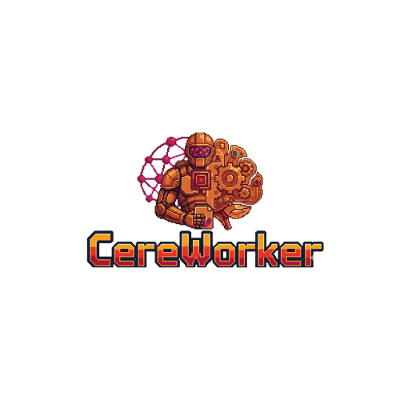
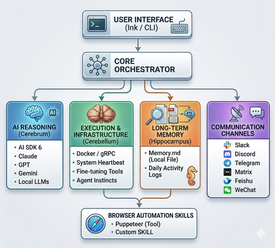

<p align="center">
  
</p>

<p align="center">
  <a href="https://www.npmjs.com/package/@cereworker/cli"></a>
  <a href="https://github.com/Producible/CereWorker/blob/main/LICENSE"></a>
</p>

A dual-LLM autonomous agent that pairs a small local model (the **Cerebellum**) with giant cloud LLMs (the **Cerebrum**) to produce work that is not just intelligent, but verifiably effective in the real world.

## Table of Contents

- [Why CereWorker](#why-cereworker)
- [Architecture](#architecture)
- [Quick Start](#quick-start)
- [How It Works](#how-it-works)
  - [Message Flow](#message-flow)
  - [Heartbeat Flow](#heartbeat-flow)
  - [Sub-Agent Flow](#sub-agent-flow)
  - [Context Window Management](#context-window-management)
  - [Exec Safety](#exec-safety-supervised-and-full-auto-modes)
  - [Emergency Stop](#emergency-stop)
  - [Stream Watchdog](#stream-watchdog)
  - [Gateway: Multi-Node Control](#gateway-multi-node-control)
  - [Browser Automation](#browser-automation)
    - [Installing the Chrome Extension](#installing-the-chrome-extension)
    - [Configuring the Extension](#configuring-the-extension)
    - [Using Extension Mode](#using-extension-mode)
  - [Headless Service Mode](#headless-service-mode)
  - [Channel Flow](#channel-flow)
- [Self-Improvement](#self-improvement-beyond-prompt-engineering)
- [Packages](#packages)
- [Built-in Tools](#built-in-tools)
- [Skills](#skills)
- [Cerebellum Models](#cerebellum-models)
- [Hippocampus: Memory System](#hippocampus-memory-system)
- [Configuration](#configuration)
- [Development](#development)
- [Acknowledgments](#acknowledgments)
- [License](#license)

## Why CereWorker

Most AI agents today are built on a single giant LLM. They reason well, but they have critical blind spots:

- **They forget.** Context windows are finite. Prompt-engineered memory (like injecting past summaries) is fragile and degrades over time. The agent loses track of what it learned three conversations ago.
- **They lie about their work.** A giant LLM can confidently report "I wrote the file" or "I sent the request" without the action actually succeeding. There is no independent verification layer.
- **They run on external schedules.** Cron jobs and timers are rigid. They don't understand "check this when the system seems idle" or "run this more frequently when things are failing." The scheduling has no intelligence.

CereWorker solves these problems by splitting the agent into two cooperating brains, modeled after the human nervous system:

- The **Cerebrum** (giant LLM) handles complex reasoning, planning, conversation, and tool use. It is the thinker.
- The **Cerebellum** (small local LLM, Qwen3 0.6B in Docker) handles coordination, verification, and persistent memory. It is the doer's watchdog.

This isn't just an architectural novelty. The key insight: **a 600M-parameter model cannot reason, but it can answer "yes or no."** The Cerebellum never tries to think -- it only judges simple binary facts, while deterministic code does the heavy lifting. This keeps the small model from degrading the intelligence of the real brain.

### 1. Heartbeat: Deterministic Scheduling with LLM Tiebreaker

Tasks now live in a text-backed task registry under `~/.cereworker/tasks/` and support three schedule families: interval (`every 3 hours`), exact local time (`daily at 10:00 PM` with timezone), and one-shot due tasks. Deterministic code handles slot calculation, catch-up-once behavior, and clear-cut interval decisions. Only in the ambiguous interval zone (0.8x-2.0x the interval) does the Cerebellum get asked a single binary question: "Should this task run now? yes or no." The model is a tiebreaker, not a scheduler.

### 2. Muscle+Skeleton: Programmatic Verification + Binary Verdict

When the Cerebrum says it wrote a file, **programmatic checks** verify the actual effect: does the file exist? Was it modified in the last 30 seconds? Is it non-empty? These are `os.path.exists()` and `os.stat()` calls, not LLM inference. Only after all checks pass does the Cerebellum get asked one yes/no question: "Is everything OK?" If any check fails, the result is immediately flagged without touching the model.

This means the Cerebrum gets a concrete warning appended to the tool output -- `[Cerebellum warning: file does not exist, not recently modified]` -- and can self-correct.

### 3. Instinct: Safety, Survival, and Persistent Memory

The Cerebellum is the agent's instinctive layer -- it handles the things that should never require conscious thought.

**Exec safety.** Every shell command the Cerebrum wants to run passes through an exec policy before execution. Safe read-only binaries (`ls`, `git status`, `node`, etc.) execute immediately. Destructive patterns (`rm -rf`, `curl | bash`, `git push --force`) are blocked outright. In supervised mode (default), unknown commands pause and ask the user for approval. In full-auto mode (`/auto on`), the Cerebellum pre-screens commands instead -- it answers "is this command safe? yes or no" the same way it answers every other binary question. Hard-block patterns (`rm -rf /`, `mkfs`, `dd` to block devices) are always blocked regardless of mode, because some things should never require a judgment call.

**Emergency stop.** The Cerebellum is the only component with low enough latency to respond instantly during a crisis. When the user types `/stop` -- which works even while the Cerebrum is mid-stream -- the Cerebellum triggers an immediate halt: the active stream is aborted via AbortController, all running sub-agents are cancelled, and the TUI confirms the stop. The Cerebrum is a slow thinker; the Cerebellum is a fast reflex. This is the architectural reason the emergency stop exists at the Cerebellum level rather than waiting for the Cerebrum to finish its current thought.

**Stream watchdog.** The Cerebellum monitors the main Cerebrum stream for stalls. Every 15 seconds during active streaming, it checks when the last chunk or tool call was received. If the stream goes silent beyond a configurable threshold (default 30 seconds), the Cerebellum is asked: "the stream stalled for N seconds -- should we nudge it to continue?" If yes, the stalled stream is aborted and a system message is injected telling the Cerebrum to continue where it left off. The conversation automatically resumes. This prevents the common failure mode where complex multi-tool workflows (browser automation, long API chains) cause the LLM to silently stop mid-response. The TUI shows a `[STALL]` indicator during detected stalls.

**Persistent memory.** Instead of simulating memory through prompt injection (which is lossy and context-limited), the Cerebellum periodically fine-tunes itself on conversations between the user and the agent. Knowledge is burned into model parameters, not pasted into prompts. The fine-tuning happens automatically during idle time: the Cerebellum copies itself, trains on accumulated conversations, and hot-swaps the container with updated weights. The agent genuinely learns, and that learning survives across sessions without consuming context window.

### The Design Principle

The Cerebellum is a **watchdog**, not a thinker. It answers "yes" or "no" -- nothing more. Deterministic code handles scheduling math, file system checks, and output validation. The model is a final sanity gate that uses 3 tokens per verdict. This ensures the 0.6B model never degrades the quality of the Cerebrum's work -- it only catches the Cerebrum's mistakes.

## Architecture

<p align="center">
  
</p>

The **Orchestrator** sits at the center. It routes user messages to the Cerebrum, executes tool calls, streams responses to the TUI, and listens to heartbeat events from the Cerebellum. It also manages sub-agents via the SubAgentManager. It emits typed events (`message:cerebrum:chunk`, `tool:start`, `heartbeat:tick`, `agent:spawned`, etc.) that the UI and other components subscribe to.

The **Cerebrum** wraps Vercel AI SDK 6 to provide a unified interface across providers. Switching from Claude to GPT to Gemini to a local Ollama model is a config change. The **Orchestrator** owns the tool registry and shared execution runtime, while the Cerebrum adapts those tools to provider-specific payloads. This keeps shell execution, file operations, browser automation, memory tools, and sub-agent tools on one normalized execution path.

The **Cerebellum** runs as a Python gRPC service inside a Docker container with a configurable small LLM (Qwen3 0.6B/1.7B, SmolLM2, Phi-4 Mini, or a custom model). The TypeScript side communicates with it via streaming RPCs defined in `proto/cerebellum.proto`. The container manages its own model weights and supports fine-tuning via LoRA, QLoRA, or full methods on a configurable schedule. After fine-tuning, the container can be hot-swapped with updated weights without interrupting the main process.

The **Hippocampus** is CereWorker's temporary memory layer, inspired by the brain structure that consolidates short-term memory into long-term storage. It is organized around the single learned instance: `project/` for durable curated knowledge, `daily/` for continuity logs, `session/` for per-conversation working memory, and `training/` / `finetune/` for inspectable learning artifacts. The Cerebrum reads and writes to the Hippocampus during normal conversation via memory tools. Periodically, a curator process reviews the Hippocampus and selects memories worth permanently learning -- these are extracted as structured training pairs and fed into the Cerebellum's fine-tuning pipeline. This is how ephemeral context becomes permanent knowledge without consuming context window.

The **SubAgentManager** enables the Cerebrum to spawn independent workers for parallel tasks. Each sub-agent gets its own isolated conversation, session (`session.json` + `transcript.jsonl`), and memory directory (`~/.cereworker/agents/<id>/memory/`). Sub-agents share the same Cerebrum provider and tool registry but cannot spawn sub-sub-agents (preventing infinite recursion). The Cerebellum monitors sub-agent health via the `ReportAgentStates` RPC -- deterministic checks detect stalls and timeouts, and the model answers "should we retry this stalled agent? yes/no" for ambiguous cases. The Cerebrum manages sub-agents through three tools: `spawn_agent`, `query_agents`, and `cancel_agent`.

Every conversation also carries a plain-text session ledger under `~/.cereworker/conversations/<conversationId>/sessions/`, so retries, recovery boundaries, and later inspection all stay attached to the same single-instance history instead of being reconstructed only from prompts.

### Harness Improvements

Recent harness work makes long-running tool and browser tasks much more resumable and inspectable:

- **Protocol-aware turn outcomes.** The orchestrator now classifies how a turn actually ended (`completed`, `ended_on_tool_calls`, `completion_signal_missing`, `stalled`, etc.) instead of inferring success only from final text.
- **Append-only turn journals and session ledgers.** Each turn writes plain JSONL journals and each session keeps a ledger of ingress, tool activity, recovery decisions, boundaries, memory updates, and channel/node events.
- **Recovery from verified boundaries.** Retries now resume from the latest committed boundary and browser state snapshot instead of replaying raw failed tool history or injecting a generic "continue" prompt.
- **Single-instance control plane.** Session snapshots, ledgers, and fine-tune artifacts all stay attached to the same learned instance, so continuity survives retries, restarts, and later inspection.

**Channels** are pluggable IM adapters. Each implements a simple interface: `start(handler)`, `stop()`, `send(msg)`, `isAllowed(senderId)`. The channel manager starts all enabled channels and routes inbound messages through the orchestrator, so the agent can be reached via Slack, Discord, Telegram, Matrix, Feishu, WeChat, WhatsApp, Signal, or IRC simultaneously.

## Quick Start

### One-Line Install

**Linux / macOS:**

```bash
curl -fsSL https://raw.githubusercontent.com/Producible/CereWorker/main/install.sh | bash
```

**Windows (PowerShell):**

```powershell
irm https://raw.githubusercontent.com/Producible/CereWorker/main/install.ps1 | iex
```

The installer detects your OS, installs Node.js if missing, installs CereWorker via npm, sets up Docker for Cerebellum, and launches the onboarding wizard.

### Manual Install

**Prerequisites:** Node.js 22+, Docker (optional, for Cerebellum)

```bash
npm install -g @cereworker/cli
```

CereWorker persists conversations, pairing state, plans, and fine-tune material as plain JSON/JSONL files under `~/.cereworker/`, so runs can be inspected and diffed by hand. Per-turn recovery journals are stored under `~/.cereworker/conversations/<conversationId>/turns/` and pruned automatically by age and count.

### Setup

The easiest way to get started is the interactive onboarding wizard:

```bash
cereworker onboard
```

The wizard walks you through:
- **LLM provider** -- Anthropic, OpenAI API, OpenAI Codex (ChatGPT OAuth), Google, OpenRouter, DeepSeek, xAI, Mistral, Together, Moonshot, MiniMax, MiniMax Portal (OAuth), or local (Ollama/vLLM)
- **Cerebellum model** -- choose from Qwen3, SmolLM2, Phi-4 Mini, or a custom checkpoint, with hardware-aware recommendations
- **Fine-tuning** -- method (Auto/LoRA/QLoRA/Full) and schedule, with GPU/RAM detection
- **Messaging channels** -- enable Slack, Discord, Telegram, Matrix, Feishu, WeChat, WhatsApp, Signal, or IRC
- **Config output** -- writes `~/.cereworker/config.yaml` with env var references for secrets

For providers with multiple connection modes, onboarding groups them as **provider -> type**. For example, you select `OpenAI`, then choose either `API` or `Codex (ChatGPT OAuth)`. MiniMax works the same way with `API` and `Portal (OAuth)`.

After onboarding, start the agent:

```bash
cereworker              # interactive TUI
cereworker serve        # headless service (for production/systemd)
cereworker images       # show local Cerebellum image and container status
cereworker images upgrade  # pull latest Cerebellum Docker image
```

On **first run**, CereWorker discovers its identity through conversation — it asks your name for it, its role, recurring tasks, and communication style. The answers are saved to `~/.cereworker/instance.json` and seeded as training data for the Cerebellum's first fine-tune cycle. Each instance develops a unique identity through fine-tuning that persists across sessions.

Or configure manually:

```bash
mkdir -p ~/.cereworker
cat > ~/.cereworker/config.yaml << 'EOF'
cerebrum:
  defaultProvider: anthropic
  defaultModel: claude-sonnet-4-6
  providers:
    anthropic:
      apiKey: ${ANTHROPIC_API_KEY}
EOF

ANTHROPIC_API_KEY=sk-... cereworker
```

For OpenAI Codex subscription OAuth, use the dedicated provider:

```bash
cereworker auth openai-codex
```

```yaml
cerebrum:
  defaultProvider: openai-codex
  defaultModel: gpt-5.4
  providers:
    openai-codex:
      auth: oauth
```

For MiniMax Portal OAuth, use the dedicated provider:

```bash
cereworker auth minimax-portal
```

```yaml
cerebrum:
  defaultProvider: minimax-portal
  defaultModel: MiniMax-M2.7
  providers:
    minimax-portal:
      auth: oauth
      baseUrl: https://api.minimax.io/anthropic
```

### Cerebrum Providers

All cloud providers support custom model IDs through onboarding's **Other (enter model ID)** option or by editing `cerebrum.defaultModel` manually.

| Provider | Auth | Env var | Notes |
|----------|------|---------|-------|
| Anthropic | API key | `ANTHROPIC_API_KEY` | Claude models |
| OpenAI | API key | `OPENAI_API_KEY` | Direct OpenAI API only |
| OpenAI Codex | OAuth | — | ChatGPT/Codex subscription flow via `cereworker auth openai-codex` |
| Google | API key or OAuth | `GOOGLE_API_KEY` | Gemini models |
| OpenRouter | API key | `OPENROUTER_API_KEY` | Default model is `auto` |
| DeepSeek | API key | `DEEPSEEK_API_KEY` | Uses DeepSeek OpenAI-compatible API |
| xAI | API key | `XAI_API_KEY` | Grok models with xAI-specific tool compatibility |
| Mistral | API key | `MISTRAL_API_KEY` | Uses stricter Mistral tool-call ID sanitation |
| Together | API key | `TOGETHER_API_KEY` | Curated Together-hosted open models |
| Moonshot | API key | `MOONSHOT_API_KEY` | Global/CN endpoint choice is stored in `baseUrl` |
| MiniMax | API key | `MINIMAX_API_KEY` | Global/CN endpoint choice is stored in `baseUrl`; Anthropic-compatible transport |
| MiniMax Portal | OAuth | — | Browser/device OAuth flow via `cereworker auth minimax-portal`; endpoint choice is stored in `baseUrl` |
| Local | none | — | Ollama, vLLM, or other local OpenAI-compatible endpoint |

### From source

```bash
git clone https://github.com/Producible/CereWorker.git
cd CereWorker
pnpm install
pnpm build
pnpm start
```

### Start the Cerebellum (optional)

The onboarding wizard (`cereworker onboard`) automatically pulls the Cerebellum Docker image. To start it manually:

```bash
docker pull cereworker/cerebellum
docker run -d --name cereworker-cerebellum -p 50051:50051 cereworker/cerebellum
```

Or from source:

```bash
docker compose up -d cerebellum
```

If you pull source changes that modify [`proto/cerebellum.proto`](/home/vincent/Projects/CereWorker/proto/cerebellum.proto) or [`cerebellum/src/heartbeat.py`](/home/vincent/Projects/CereWorker/cerebellum/src/heartbeat.py), rebuild the local Cerebellum container before restarting:

```bash
docker compose build cerebellum
docker compose up -d cerebellum
```

### Updating

CereWorker checks for new versions on startup. If a newer release is available on npm, the banner shows an update notice with the install command. The check is cached for 24 hours and runs in the background (no startup delay). `cereworker -v` also shows available updates.

### Updating the Cerebellum

When a new Cerebellum image is published, CereWorker automatically pulls it in the background on startup. To update the image explicitly:

```bash
cereworker images upgrade
```

This pulls the latest `cereworker/cerebellum` image from Docker Hub and removes the old container so it gets recreated with the new image on next start. To check the current image status:

```bash
cereworker images
```

### Enable IM Channels (optional)

Add channel config to `~/.cereworker/config.yaml`:

```yaml
channels:
  slack:
    enabled: true
    botToken: xoxb-...
    appToken: xapp-...
  discord:
    enabled: true
    token: ...
    applicationId: "..."         # enables / slash command autocomplete
  telegram:
    enabled: true
    token: ...
  matrix:
    enabled: true
    homeserver: https://matrix.org
    token: ...
    userId: "@bot:matrix.org"
  feishu:
    enabled: true
    appId: cli_...
    appSecret: ...
    verificationToken: ...   # optional
    encryptKey: ...           # optional
  wechat:
    enabled: true
    puppet: wechaty-puppet-wechat4u  # or other puppet provider
    token: ...                       # optional, depends on puppet
  whatsapp:
    enabled: true                    # scans QR code on first run
  signal:
    enabled: true
    account: "+15551234567"          # E.164 phone number
    signalCliUrl: http://127.0.0.1:8080  # signal-cli REST daemon
  irc:
    enabled: true
    host: irc.libera.chat
    port: 6697
    tls: true
    nick: cereworker
    channels: ["#mychannel"]
```

## How It Works

### Message Flow

When you type a message in the TUI:

1. The Orchestrator appends it to the conversation and calls the Cerebrum
2. The Cerebrum streams its response via AI SDK, emitting text chunks to the TUI in real-time
3. If the Cerebrum decides to use a tool (shell, file, browser), the tool executes and the result feeds back into the LLM for the next reasoning step
4. The final response is appended to the conversation
5. Asynchronously, the Cerebellum is notified of the completed turn (for monitoring and future fine-tuning)

### Heartbeat Flow

Running in parallel:

1. The Cerebellum's heartbeat engine ticks every N seconds (configurable, default 30s)
2. For each registered task, deterministic code evaluates its schedule type: interval cadence, exact local-time slots with timezone/catch-up handling, or one-shot due time
3. Interval tasks still use the old fast path: too early (< 0.8x interval)? skip. Way overdue (> 2.0x interval)? invoke. Only the ambiguous interval zone needs a model tiebreaker
4. "Invoke" actions stream back to the TypeScript orchestrator via gRPC server-streaming
5. The orchestrator executes the invoked tasks (which may trigger Cerebrum calls, tool runs, or notifications)

### Sub-Agent Flow

The Cerebrum can spawn independent sub-agents for parallel work:

1. The Cerebrum calls `spawn_agent` with a task description, creating an async worker. Set `longRunning: true` for tasks that may take hours or days (unlimited timeout, session preserved for recovery)
2. Each sub-agent gets its own isolated conversation, session directory, and Hippocampus memory at `~/.cereworker/agents/<id>/memory/`
3. Sub-agents share the same Cerebrum provider and tools (except they cannot spawn further sub-agents). Long-running agents call `report_progress` to report intermediate status
4. The Cerebellum is the **sole lifecycle manager** for sub-agents -- there are no hard timeouts on the TypeScript side. Every heartbeat tick, the Cerebellum evaluates agent health via `ReportAgentStates` with progress-aware logic:
   - **Active**: agent has recent activity or progress reports -- no action needed
   - **Stalled (no progress)**: deterministic stall detection, LLM tiebreaker for ambiguous cases ("should we retry? yes/no")
   - **Past deadline + making progress**: LLM asked "agent exceeded deadline but reports progress -- should it continue?" before killing
   - **Past deadline + no progress**: timed out deterministically
5. Corrective actions are applied automatically: `ping` (inject a prod message), `retry` (re-spawn), or `cancel`
6. The Cerebrum can query agent status (including progress) via `query_agents` and cancel via `cancel_agent`. Users can monitor and stop agents via `/agents stop <id>` and `/agents info <id>`
7. **Restart recovery**: if CereWorker restarts while agents are running, they are automatically resumed from their persisted `session.json` and text-backed conversation files. A resume system message is injected so the agent can continue where it left off
8. Completed agents with `cleanup: "delete"` have their session directories removed; `cleanup: "keep"` agents (and all `longRunning` agents) persist for later reference

### Context Window Management

Long conversations no longer crash. Before each Cerebrum call, the orchestrator estimates total tokens (chars/4 heuristic with a 1.2x safety margin). When the estimate exceeds a configurable threshold (default 80% of the model's context window), older messages are summarized into a single system message via an LLM call, and only the most recent messages (default 10) are kept verbatim. This happens transparently -- the user sees no interruption.

Configure via:

```yaml
cerebrum:
  contextWindow: 128000        # model context window size (tokens)
  compaction:
    enabled: true
    threshold: 0.8             # compact at 80% of context window
    keepRecentMessages: 10     # keep last N messages verbatim
```

### Exec Safety: Supervised and Full-Auto Modes

Shell command execution has two operating modes, toggled via `/auto [on|off]`:

- **Supervised mode** (default): Safe read-only commands (`ls`, `cat`, `git status`, `node`, etc.) execute automatically. Destructive patterns (`rm -rf`, `curl | bash`, `git push --force`, etc.) are blocked outright. Unknown commands prompt the user for approval before executing.

- **Full-auto mode**: All commands execute without prompts. The Cerebellum pre-screens commands as a safety net. Hard-block patterns (`rm -rf /`, `mkfs`, `dd if=... of=/dev/...`) are always blocked regardless of mode.

### Emergency Stop

Type `/stop` at any time -- even while the Cerebrum is streaming -- to immediately abort all operations. The orchestrator cancels the active stream, terminates all running sub-agents, and emits an `emergency:stop` event. The TUI confirms the stop.

### Stream Watchdog

The Cerebellum monitors the main Cerebrum stream for stalls. During active streaming, a watchdog checks every 15 seconds whether any chunks or tool results have been received. If the stream goes silent beyond the threshold (default 30 seconds), the Cerebellum is asked: "should we nudge it to continue?" If yes, the stalled stream is aborted via AbortSignal, a system message is injected, and the conversation automatically resumes. The TUI shows a `[STALL]` indicator during detected stalls.

Configure via:

```yaml
cerebrum:
  streamStallThreshold: 30   # seconds before stall detection
  maxNudgeRetries: 2         # max nudge attempts per turn
```

This prevents the common failure mode where complex multi-tool workflows (browser automation, long API chains) cause the LLM to silently stop mid-response.

### Gateway: Multi-Node Control

CereWorker supports a hub-spoke topology where one instance (the **gateway**) coordinates multiple instances (**nodes**) on other machines. The gateway's Cerebrum can call tools on any connected node as if they were local.

**Gateway mode**: One CereWorker instance runs the Cerebrum and starts a WebSocket server. Nodes connect and register their local tools. The gateway creates proxy tools (`shell@workstation-gpu`, `file@nas-server`, etc.) that the Cerebrum can call during normal reasoning. Tool invocations are forwarded over a **versioned session bus envelope** with per-node sequencing, acknowledgements, replay state, and session metadata (`conversationId`, `sessionId`, `turnId`, `attempt`). Remote `tool.started`, `tool.finished`, and `node.status` events are written back into the same session ledger as local work.

**Node mode**: A CereWorker instance connects to a gateway and exposes its local tools. It receives session-aware invoke envelopes, executes them locally, emits tool lifecycle events, and returns structured results. Emergency stop commands propagate from gateway to all nodes.

**Standalone mode** (default): No gateway behavior. Everything works as a single-machine agent.

Configure via:

```yaml
# Gateway instance
gateway:
  mode: gateway
  port: 18800
  token: ${GATEWAY_TOKEN}    # shared secret for node auth

# Node instance
gateway:
  mode: node
  gatewayUrl: ws://gateway-host:18800
  nodeId: workstation-gpu
  token: ${GATEWAY_TOKEN}
  capabilities: [shell, file]  # tools to expose (empty = all)
```

Use `/nodes` in the TUI to see connected nodes (gateway mode) or connection status (node mode). For remote access, use Tailscale, WireGuard, or SSH tunnels -- do not expose the WebSocket port on the public internet without TLS.

### Browser Automation

CereWorker's browser tools support three backend modes, configured via `tools.browser.mode`:

**Launch mode** (default): Starts a Puppeteer-managed browser. Set `headless: false` to see the browser window. Best for automated scraping and testing where no existing session is needed.

**Connect mode**: Attaches to a running Chrome instance via CDP. Start Chrome with `--remote-debugging-port=9222` and set `mode: connect`. Useful when you need access to an already-authenticated browser session from the command line.

**Extension mode**: Controls the user's actual Chrome browser through the CereWorker Browser Bridge extension. The agent sees the same tabs, cookies, and sessions as the user -- ideal for tasks like posting to social media, managing dashboards, or any workflow that requires an authenticated browser.

#### Installing the Chrome Extension

The extension is a static folder (no build step) located at `packages/browser/extension/` in the source repo.

**From source:**

```bash
git clone https://github.com/Producible/CereWorker.git
# The extension is at CereWorker/packages/browser/extension/
```

**From npm install:**

```bash
# Print the extension directory path
cereworker extension-dir
```

Then load it into Chrome:

1. Open `chrome://extensions` in Chrome
2. Enable **Developer mode** (toggle in the top-right corner)
3. Click **Load unpacked** and select the `extension/` directory
4. The CereWorker Browser Bridge icon appears in your toolbar

#### Configuring the Extension

Click the extension icon's three-dot menu -> **Options** (or right-click the icon -> **Options**):

- **Relay Port**: Must match your CereWorker config (default `18900`)
- **Token**: Must match `tools.browser.extension.token` in your config (leave empty if no token is set)
- Click **Save & Test Connection** to verify the relay server is reachable

#### Using Extension Mode

**Option A — Interactive CLI:**

```bash
cereworker configure browser
# Select "Extension", set relay port and token interactively
```

**Option B — Manual config** (`~/.cereworker/config.yaml`):

```yaml
tools:
  browser:
    mode: extension
    extension:
      relayPort: 18900
      # token: my-secret    # optional, must match extension options
```

Then start CereWorker:

```bash
cereworker
```

3. Click the extension icon in Chrome -- the badge indicates status:
   - `ON` (green): Connected to CereWorker relay
   - `...` (yellow): Connecting
   - `!` (red): Connection error
   - Click again to disconnect

4. The TUI status bar shows `[EXT]` when the extension is active

The agent can now navigate, click, type, take screenshots, and manage tabs in your actual browser. It automatically prefers `httpFetch` for API calls and only uses browser tools for pages requiring JavaScript rendering or interactive elements.

### Headless Service Mode

For production deployments, CereWorker can run without the TUI as a persistent background service:

```bash
cereworker serve
```

This starts the orchestrator, channels, and gateway/node connections headlessly. All log levels write to stderr (captured by journalctl) and to `~/.cereworker/cereworker.log`. A health HTTP endpoint is exposed for monitoring:

| Mode | Health endpoint | Port |
|------|-----------------|------|
| Gateway | `/healthz` | 18801 (WS server uses 18800) |
| Node | `/healthz` | 18800 |
| Standalone | `/healthz` | 18800 |

Systemd unit templates are provided in `systemd/`:

```bash
sudo cp systemd/cereworker-gateway.service /etc/systemd/system/
sudo systemctl daemon-reload
sudo systemctl enable --now cereworker-gateway
```

The service handles `SIGTERM`/`SIGINT` for graceful shutdown and restarts on failure. Both unit files include systemd hardening (`NoNewPrivileges`, `ProtectSystem=strict`, `ProtectHome=read-only`).

### Channel Flow

When a message arrives from Slack/Discord/Telegram/Matrix/Feishu/WeChat/WhatsApp/Signal/IRC:

1. The channel adapter receives it and checks the sender against the allowlist
2. If allowed, it forwards the message text to the orchestrator
3. The orchestrator processes it the same way as a TUI message (Cerebrum reasoning + tools)
4. The response is sent back through the same channel adapter

**Slash command autocomplete**: Discord registers Application Commands on startup (when `applicationId` is set), so users see all CereWorker commands in the `/` menu. Telegram registers commands via `setMyCommands()` for the same autocomplete experience. Other platforms process `/command` as plain text.

### Comparison with Traditional Agents

| Aspect | Traditional agent | CereWorker |
|--------|------------------------------|------------|
| Memory | Prompt injection, vector DB search | Fine-tuned into Cerebellum parameters |
| Scheduling | Cron expressions, fixed timers | Small LLM evaluates what needs attention |
| Verification | Trust LLM output | Cerebellum monitors actual disk/network effects |
| Context limits | Summarize and hope | Knowledge survives in model weights |
| Sub-agents | Hard timeouts, lost on restart | Cerebellum-managed lifecycle with progress tracking and restart recovery |
| Multi-node | Custom gateway or none | Built-in WebSocket gateway with remote tool proxying |
| Identity | Static config, swappable profiles | Learned through conversation, fine-tuned into weights |
| Cost | Every request hits giant LLM | Routine decisions handled by local 0.6B model |

## Self-Improvement: Beyond Prompt Engineering

Most AI agents today are static -- they improve only when a developer ships a new prompt or a new model version drops. CereWorker is designed to improve itself continuously through architectural mechanisms that no amount of prompt engineering can replicate.

### Weight-Level Learning, Not Context Tricks

Traditional agents simulate memory by stuffing summaries into the context window. This is lossy, expensive, and bounded by token limits. CereWorker's Hippocampus-to-Cerebellum pipeline turns conversations into **actual model weight updates**. Knowledge isn't recalled -- it's *recognized*, the way a person doesn't "look up" how to ride a bike. After fine-tuning, the Cerebellum responds faster, uses zero context tokens for learned knowledge, and retains it permanently across sessions.

### Adaptive Scheduling That Learns From Itself

A cron job runs whether it's useful or not. CereWorker's Heartbeat asks the Cerebellum "what needs attention right now?" every tick. As the Cerebellum fine-tunes on past decisions -- which tasks were invoked, which were pointless, which were deferred too long -- its scheduling judgment improves. The agent learns *when* to act, not just *what* to do.

### Verification Feedback Loop

When the Cerebellum catches the Cerebrum lying (e.g., claiming a file was written when it wasn't), that failure becomes a training signal. Over time, the Cerebellum builds an internal model of which tool outputs to trust and which to double-check. This is a safety property that emerges from architecture, not from a system prompt saying "please verify your work."

### Compounding Specialization

Every user's CereWorker diverges. A developer's Cerebellum learns to schedule builds and check test results. A researcher's learns to watch for new papers and summarize findings. A DevOps engineer's learns to correlate deploy times with incident frequency. The fine-tuning is unsupervised and domain-agnostic -- the architecture doesn't know what you do, but the weights will.

### Cost Curve That Bends Down

Other agents get more expensive as they get smarter (longer prompts, more retrieval, bigger context). CereWorker gets *cheaper*: knowledge that moves from Hippocampus files into Cerebellum weights no longer needs to be fetched, embedded, or injected. The more the agent learns, the less work the Cerebrum has to do per request.

| | Prompt-Engineered Agents | CereWorker |
|---|---|---|
| Memory | Injected into context (lossy, bounded) | Fine-tuned into weights (permanent, zero-cost at inference) |
| Scheduling | Static rules or rigid tool calls | Small LLM that improves its own judgment over time |
| Verification | "Please double-check" in system prompt | Independent model monitors actual side effects |
| Specialization | Same generic agent for every user | Weights diverge per user's domain and habits |
| Cost over time | Grows (more context, more retrieval) | Shrinks (learned knowledge exits the prompt) |

## Packages

| Package | npm | Description |
|---------|-----|-------------|
| [`@cereworker/cli`](apps/cli) | [](https://www.npmjs.com/package/@cereworker/cli) | Ink 5 terminal UI |
| [`@cereworker/core`](packages/core) | [](https://www.npmjs.com/package/@cereworker/core) | Orchestrator, message model, typed events, conversation store |
| [`@cereworker/cerebrum`](packages/cerebrum) | [](https://www.npmjs.com/package/@cereworker/cerebrum) | AI SDK 6 multi-provider LLM abstraction + built-in tools |
| [`@cereworker/cerebellum-client`](packages/cerebellum-client) | [](https://www.npmjs.com/package/@cereworker/cerebellum-client) | gRPC client for the Cerebellum container |
| [`@cereworker/channels`](packages/channels) | [](https://www.npmjs.com/package/@cereworker/channels) | IM adapters (Slack, Discord, Telegram, Matrix, Feishu, WeChat, WhatsApp, Signal, IRC) |
| [`@cereworker/browser`](packages/browser) | [](https://www.npmjs.com/package/@cereworker/browser) | Browser automation (Puppeteer, CDP, Chrome extension) |
| [`@cereworker/skills`](packages/skills) | [](https://www.npmjs.com/package/@cereworker/skills) | SKILL.md plugin loader and registry |
| [`@cereworker/hippocampus`](packages/hippocampus) | [](https://www.npmjs.com/package/@cereworker/hippocampus) | Temporary memory store, memory tools, fine-tune curator |
| [`@cereworker/gateway`](packages/gateway) | [](https://www.npmjs.com/package/@cereworker/gateway) | WebSocket gateway for multi-node control |
| [`@cereworker/config`](packages/config) | [](https://www.npmjs.com/package/@cereworker/config) | YAML config with Zod validation, env var interpolation |

## Built-in Tools

**Shell & File Operations** -- Execute commands, read/write files, edit files by exact match, list directories, search file contents (grep/ripgrep), find files by glob pattern. Shell execution is governed by the exec policy: safe binaries (ls, git, node, etc.) auto-execute, destructive patterns are blocked, and unknown commands prompt for approval in supervised mode

**Browser Automation** -- Navigate, screenshot, click, type, evaluate JS, wait for elements, manage tabs (list/switch/open/close). Three backend modes: **launch** (Puppeteer headless), **connect** (CDP to running Chrome via `--remote-debugging-port`), or **extension** (control the user's actual Chrome session via the CereWorker Browser Bridge extension)

**HTTP & Web Search** -- Fetch URLs (`httpFetch`) with timeout and private-IP blocking. Search the web (`webSearch`) via DuckDuckGo, no API key required

**Memory (Hippocampus)** -- Read/write MEMORY.md, append daily logs, search across memory files

**Sub-Agents** -- Spawn parallel workers (`spawn_agent` with optional `longRunning: true` for hours/days tasks), check status and progress (`query_agents`), cancel (`cancel_agent`). Each sub-agent has isolated memory and session. Long-running agents call `report_progress` to report intermediate status. Agents are automatically recovered after a restart

## Skills

Skills are defined as `SKILL.md` files with YAML frontmatter:

```markdown
---
name: github
description: "GitHub operations via gh CLI"
metadata:
  cereworker:
    requires:
      bins: ["gh"]
---

# GitHub Skill
Use the `gh` CLI to interact with GitHub...
```

Place skills in `~/.cereworker/skills/` or the project's `skills/` directory.

## Cerebellum Models

The Cerebellum supports multiple small LLMs, selectable during onboarding or via config:

| Model | HuggingFace ID | Size | Min RAM | Best for |
|-------|---------------|------|---------|----------|
| Qwen3 0.6B | `Qwen/Qwen3-0.6B` | ~1.2 GB | 2 GB | CPU-only, low-memory systems |
| Qwen3 1.7B | `Qwen/Qwen3-1.7B` | ~3.4 GB | 4 GB | CPU with 8+ GB RAM |
| SmolLM2 360M | `HuggingFaceTB/SmolLM2-360M-Instruct` | ~720 MB | 1.5 GB | Ultra-lightweight, fastest |
| SmolLM2 1.7B | `HuggingFaceTB/SmolLM2-1.7B-Instruct` | ~3.4 GB | 4 GB | Good balance of speed and quality |
| Phi-4 Mini 3.8B | `microsoft/Phi-4-mini-instruct` | ~7.6 GB | 8 GB | GPU recommended, best quality |
| Custom | local path | varies | varies | Your own fine-tuned checkpoint |

Fine-tuning methods: **Auto** (detects your hardware), **LoRA** (GPU 4+ GB VRAM), **QLoRA** (GPU 2+ GB VRAM), **Full** (CPU with 16+ GB RAM or GPU with 8+ GB VRAM). Full fine-tuning works on CPU-only machines using float32 precision. Schedule: Auto (idle time), Hourly, Daily, or Weekly.

## Hippocampus: Memory System

The Hippocampus is CereWorker's temporary memory layer that bridges conversations and fine-tuning:

```
~/.cereworker/memory/
  project/
    MEMORY.md            # Curated long-term notes (always loaded)
  daily/
    2026-03-08.md        # Today's continuity log
    2026-03-07.md        # Yesterday's log
  session/
    <conversation-id>.md # Per-session working memory transcript
  training/              # Human-readable derived training artifacts
~/.cereworker/conversations/
  <conversation-id>/
    meta.json
    messages.jsonl
    sessions/
      <session-id>.jsonl # Session ledger / recovery events
    turns/
      <turn-id>.jsonl    # Per-turn journal entries
~/.cereworker/pairing/
  requests.jsonl
  approved-users.jsonl
~/.cereworker/plans/
  <plan-id>.json
~/.cereworker/finetune/
  queue/
    discovery.jsonl
    conversations.jsonl
    curated-memory.jsonl
  rounds/
    <job-id>/
      manifest.json
      training.jsonl
      sources/
        discovery.jsonl
        conversations.jsonl
        curated-memory.jsonl
```

The Cerebrum reads and writes memory through four tools: `memory_read`, `memory_write`, `memory_log`, and `memory_search`. During normal operation, completed turns can also append a short per-session markdown trace under `memory/session/` so the instance keeps a working memory lane separate from curated project knowledge. Stop hooks now also export **daily continuity summaries** and **structured training candidates** (recovery, completion, verification, and session examples) as human-readable artifacts. Periodically, a **curator** reviews the Hippocampus and asks the Cerebrum: "Which of these memories contain durable knowledge worth permanently learning?" The answer is extracted as structured instruction/response pairs and queued for the Cerebellum's fine-tuning pipeline together with instance/session metadata.

This creates a natural flow: conversation --> turn journal + session ledger + Hippocampus files --> curation / stop-hook extraction --> fine-tuning queue --> per-round archive --> permanent knowledge (model weights).

On first start after upgrading from the old SQLite-backed layout, CereWorker exports legacy `conversations.db` data into the text layout above and keeps the original file as `conversations.db.bak`.

## Configuration

Config is loaded with cascading precedence:

1. Built-in defaults
2. `~/.cereworker/config.yaml` (global)
3. `./.cereworker.yaml` (project-local)
4. Environment variables (`ANTHROPIC_API_KEY`, `OPENAI_API_KEY`, `GOOGLE_API_KEY`, `OPENROUTER_API_KEY`, `DEEPSEEK_API_KEY`, `XAI_API_KEY`, `MISTRAL_API_KEY`, `TOGETHER_API_KEY`, `MOONSHOT_API_KEY`, `MINIMAX_API_KEY`)
5. CLI flags

Full config example:

```yaml
# profile is learned through discovery on first run
# override here if needed:
# profile:
#   name: Cere
#   role: full-stack developer
#   traits: [concise, proactive]

cerebrum:
  defaultProvider: anthropic
  defaultModel: claude-sonnet-4-6
  providers:
    anthropic:
      apiKey: ${ANTHROPIC_API_KEY}
    # direct OpenAI API usage:
    # openai:
    #   apiKey: ${OPENAI_API_KEY}
    # OpenRouter:
    # openrouter:
    #   apiKey: ${OPENROUTER_API_KEY}
    # DeepSeek:
    # deepseek:
    #   apiKey: ${DEEPSEEK_API_KEY}
    # xAI:
    # xai:
    #   apiKey: ${XAI_API_KEY}
    # Mistral:
    # mistral:
    #   apiKey: ${MISTRAL_API_KEY}
    # Together:
    # together:
    #   apiKey: ${TOGETHER_API_KEY}
    # Moonshot global or CN:
    # moonshot:
    #   apiKey: ${MOONSHOT_API_KEY}
    #   baseUrl: https://api.moonshot.ai/v1
    # MiniMax global or CN:
    # minimax:
    #   apiKey: ${MINIMAX_API_KEY}
    #   baseUrl: https://api.minimax.io/anthropic
    # ChatGPT/Codex subscription OAuth:
    # openai-codex:
    #   auth: oauth
    # MiniMax Portal OAuth:
    # minimax-portal:
    #   auth: oauth
    #   baseUrl: https://api.minimax.io/anthropic
  contextWindow: 128000
  streamStallThreshold: 30     # seconds before Cerebellum nudges stalled stream
  maxNudgeRetries: 2           # max nudge attempts per turn
  compaction:
    enabled: true
    threshold: 0.8
    keepRecentMessages: 10

cerebellum:
  enabled: true
  model:
    source: huggingface
    id: Qwen/Qwen3-0.6B
  finetune:
    enabled: true
    method: auto       # auto | lora | qlora | full
    schedule: auto     # auto | hourly | daily | weekly
  docker:
    autoStart: true

hippocampus:
  enabled: true
  directory: ~/.cereworker/memory
  maxDailyLogDays: 30
  autoLog: true

conversations:
  turnJournals:
    maxDays: 30
    maxFilesPerConversation: 100

subAgents:
  enabled: true
  maxConcurrent: 5
  defaultTimeoutMinutes: 5
  monitorIntervalSeconds: 30

tools:
  shell:
    autoMode: false              # true = full-auto (no approval prompts)
  browser:
    enabled: true
    mode: launch                   # launch | connect | extension
    headless: true
    cdpPort: 9222                  # for connect mode
    extension:
      relayPort: 18900             # for extension mode
      # token: ${BROWSER_TOKEN}   # optional shared secret
  runtime:
    engine: enhanced              # enhanced | legacy
    maxResultChars: 20000
    loopDetection:
      enabled: false
      warningThreshold: 10
      criticalThreshold: 20

tui:
  showActivity: true             # false = hide tool call details and progress chatter

`tools.runtime.engine: enhanced` is the default tool runtime. It adds provider-aware tool-schema normalization, transcript repair, replay truncation, and loop detection while keeping the existing tool names and CLI UX unchanged. Set `legacy` only if you need the older behavior for compatibility or debugging.

gateway:
  mode: standalone               # standalone | gateway | node
  port: 18800
  # token: ${GATEWAY_TOKEN}     # shared secret for node auth
  # gatewayUrl: ws://host:18800 # node mode: gateway address
  # nodeId: my-node             # node mode: unique identifier
  # capabilities: [shell, file] # node mode: tools to expose

channels:
  telegram:
    enabled: true
    token: ${TELEGRAM_BOT_TOKEN}
```

## Development

```bash
pnpm install          # install deps
pnpm build            # build all packages
pnpm test             # run the full local test suite
pnpm typecheck        # type-check without emitting
pnpm dev              # run CLI in dev mode (tsx)
pnpm dev -- serve     # run headless service in dev mode
```

### Testing

```bash
pnpm test:unit             # unit and focused integration tests
pnpm test:e2e:integration  # in-process service/orchestrator end-to-end tests
pnpm test:e2e:cli          # built CLI smoke tests
pnpm test:e2e:install      # clean-install smoke against a published package
```

The test layers are split intentionally:

- `test:unit` covers the normal Vitest suite without the heavier end-to-end cases.
- `test:e2e:integration` exercises the real `createService(...)` bridge with fake providers and channel inputs, including watchdog retry behavior and channel conversation routing.
- `test:e2e:cli` builds the CLI and spawns the real `cereworker` binary to cover flows like `cereworker -v`, `cereworker images`, `cereworker images upgrade`, `cereworker serve`, and rerunning onboarding with "keep current configuration".
- `test:e2e:install` installs a published CLI into a temporary prefix and runs a blank-machine smoke flow. Override the package under test with `CEREWORKER_PACKAGE_SPEC`, for example:

```bash
CEREWORKER_PACKAGE_SPEC=@cereworker/cli@latest pnpm test:e2e:install
```

### CI

GitHub Actions runs the new test layers in two stages:

- [`.github/workflows/ci.yml`](/home/vincent/Projects/CereWorker/.github/workflows/ci.yml) runs on pull requests and pushes to `main`, and gates changes on `typecheck`, `test:unit`, `test:e2e:integration`, and `test:e2e:cli`.
- [`.github/workflows/install-smoke.yml`](/home/vincent/Projects/CereWorker/.github/workflows/install-smoke.yml) runs nightly, on manual dispatch, and on release tags. It validates a fresh npm install of the published CLI and performs a Docker image smoke check against the public Cerebellum image.

## Acknowledgments

CereWorker is built around a practical agent architecture focused on channels, skills, persistent memory, and autonomous task execution, extended here with the Cerebellum/Cerebrum dual-LLM design.

Thanks to Anthropic for open-sourcing Claude Code. Its harness design and agent workflow ideas have been a useful reference while improving CereWorker's recovery, tool execution, and long-running task behavior.

## License

MIT
